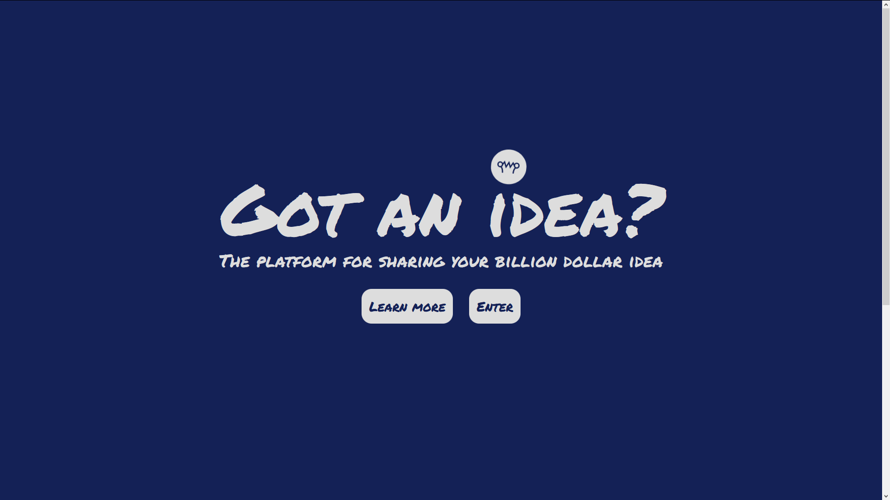
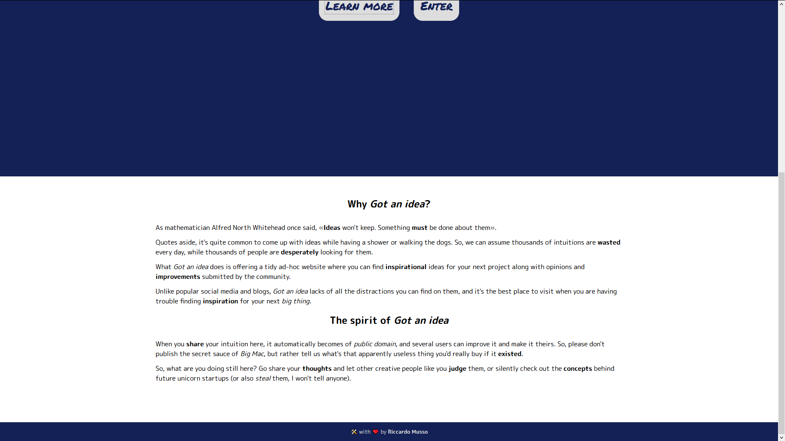
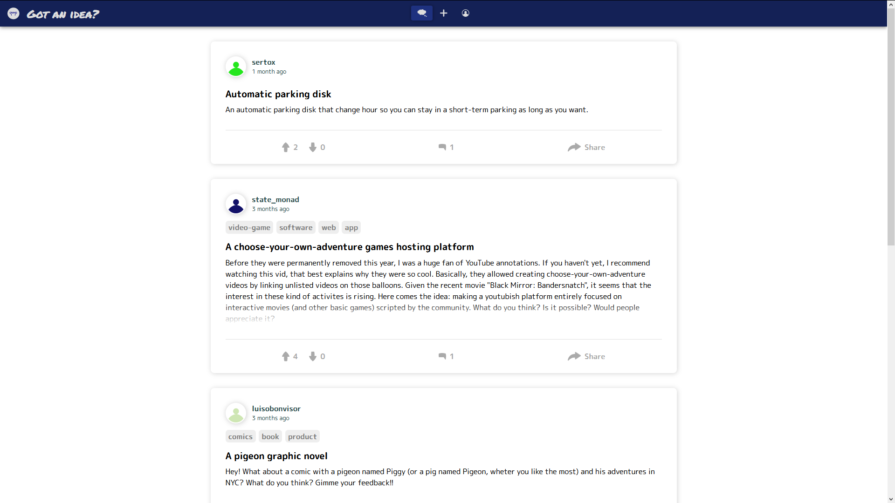
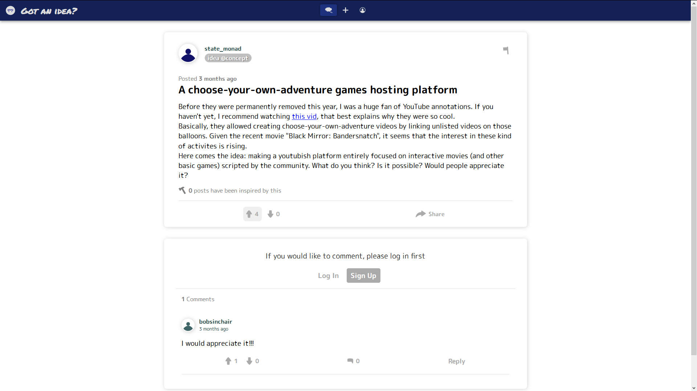
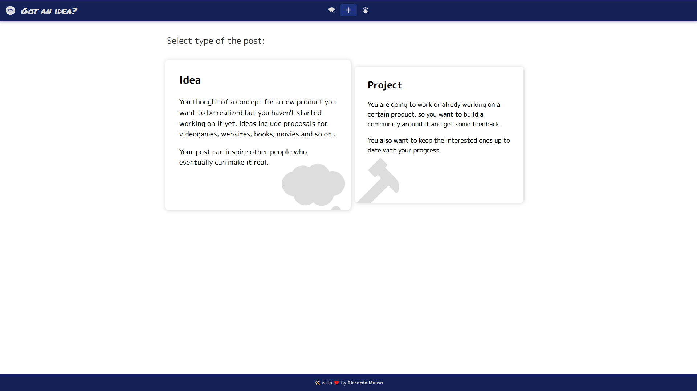
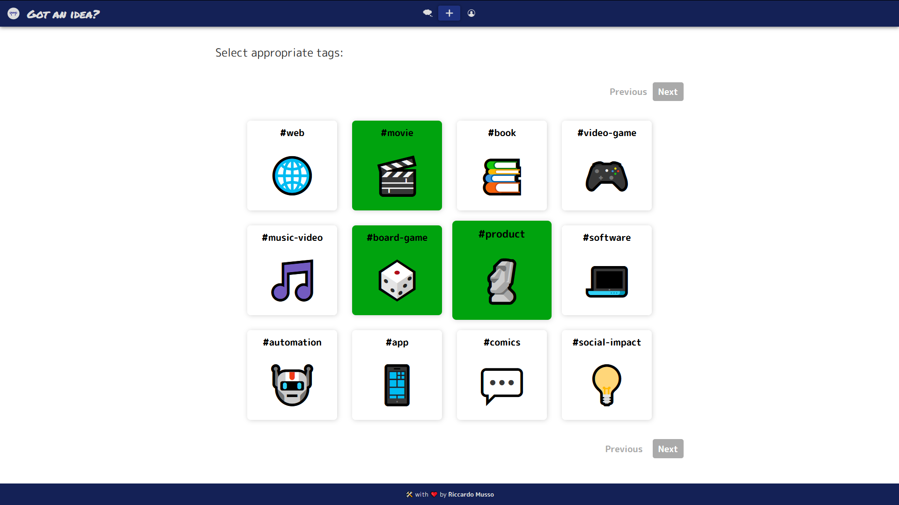
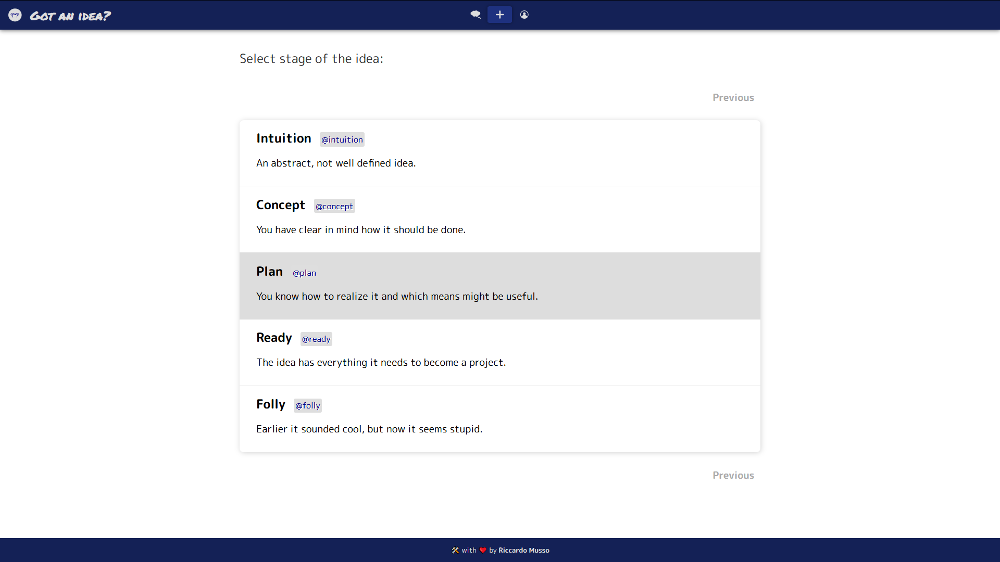
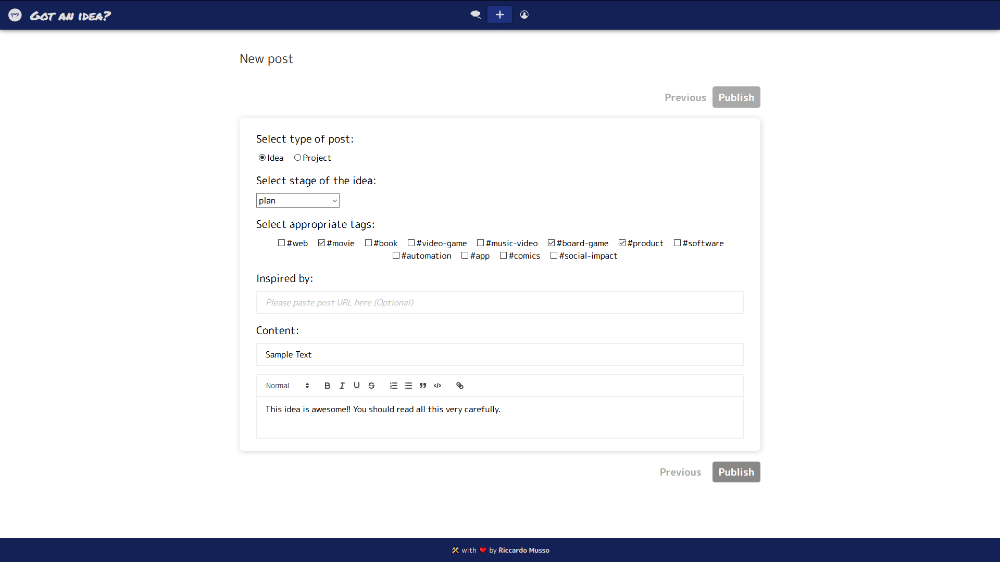
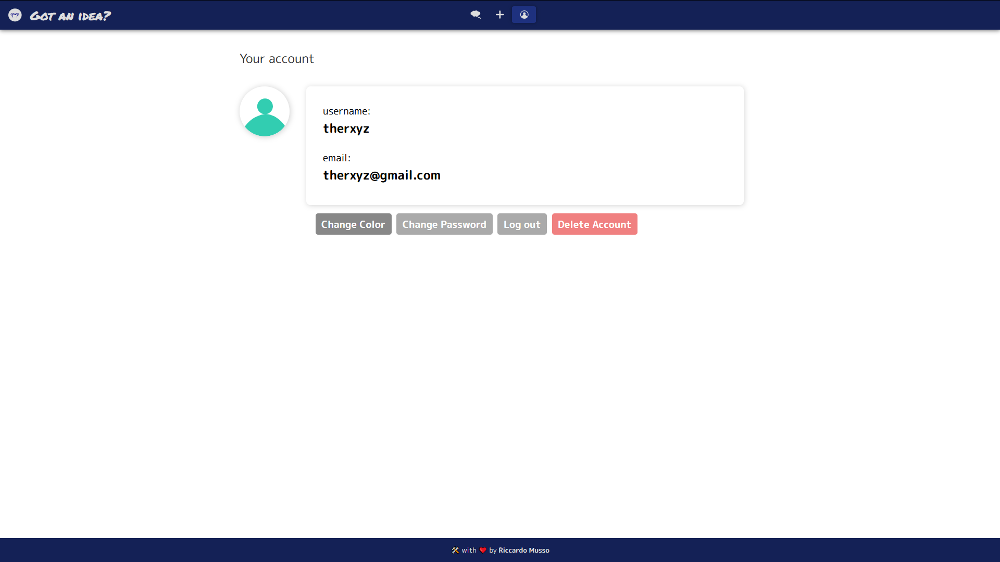

### Got an idea - *The platform for sharing your billion dollar idea*
Got an idea? was a responsive **webapp** programmed in **Javascript** using the framework React.js along with the libraries *react-redux*, *react-router*, *react-helmet*, etc.

It was deployed thanks to the **Amazon Web Services** (Lambda functions in Python, an S3 bucket, a MySQL instance, a Route53 domain).
Unfortunately, due to the high costs of service, since August 2019 it is not online anymore.

### Screenshots

### License
Got an idea? is licensed under the **Apache License 2.0** (read the 'LICENSE' file for more info)
